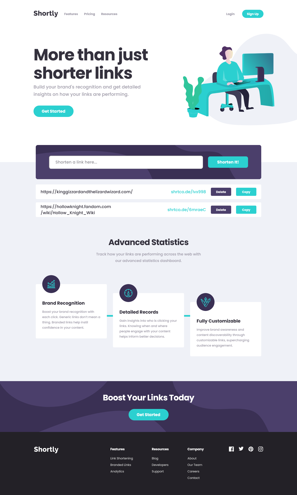

# Frontend Mentor - Shortly URL shortening API Challenge solution

This is a solution to the [Shortly URL shortening API Challenge challenge on Frontend Mentor](https://www.frontendmentor.io/challenges/url-shortening-api-landing-page-2ce3ob-G). Frontend Mentor challenges help you improve your coding skills by building realistic projects.

## Table of contents

- [Overview](#overview)
  - [The challenge](#the-challenge)
  - [Screenshot](#screenshot)
  - [Links](#links)
- [My process](#my-process)
  - [Built with](#built-with)
  - [What I learned](#what-i-learned)
  - [Continued development](#continued-development)
- [Author](#author)

## Overview

As well as the requirments listed below in the challenge, I also added an additional feature that allow users to delete any result from the list. I used some basic functionality of Framer Motion to animate the removal of these results and also incorporated an animated hamburger icon library.

- [Framer - Motion](https://www.framer.com/motion/)
- [Animated Hamburger Library](https://hamburger-react.netlify.app/)

### The challenge

Users should be able to:

- View the optimal layout for the site depending on their device's screen size
- Shorten any valid URL
- See a list of their shortened links, even after refreshing the browser
- Copy the shortened link to their clipboard in a single click
- Receive an error message when the `form` is submitted if:
  - The `input` field is empty

### Screenshot



### Links

- Solution URL: [Add solution URL here](https://your-solution-url.com)
- Live Site URL: [Netlify - Live Site](https://shortly-kiddalexx.netlify.app/)

## My process

For this project I used Trello to manage my workflow. This was the first time using it, and I found it very useful to be able to create cards for each component, and then add a checklist of tasks to complete within each component.

### Built with

- Semantic HTML5 markup
- CSS custom properties
- Flexbox
- Desktop-first workflow
- [React](https://reactjs.org/) - JS library
- Vite
- Framer Motion

### What I learned

This is my first React application, following the completion of Scrimbas basic React course. I found it to be a perfect match for the topics which were covered in that course, and to put all of those techniques into practice. This defintely helped me strengthen those skills and build some confidence with React.

I also discovered a new use for variables within CSS by assigning a variable within an element and then using that variable in a calculation within a pseudo-element, as demonstrated below:

```css
.info-card:nth-child(1) {
  --card-index: 0;
}
.info-card:nth-child(2) {
  --card-index: 1;
  transform: translateY(4.4rem);
}
.info-card:nth-child(3) {
  --card-index: 2;
  transform: translateY(8.8rem);
}

.info-card:not(:last-child)::after {
  content: '';
  display: block;
  position: absolute;
  right: 0;
  /* Ensure line position matches for each card */
  bottom: calc(var(--card-index) * 4.4rem + 10.7rem);
  transform: translateX(100%);
  width: 3rem;
  height: 0.8rem;
  background-color: var(--cyan);
}
```

### Continued development

My plan is to create a few more simple React applications to further strengthen my skills before delving into more advanced React topics.

## Author

- Frontend Mentor - [@KiddAlexx](https://www.frontendmentor.io/profile/KiddAlexx)
- Twitter - [@KiddAlexxCodes](https://www.https://twitter.com/KiddAlexxCodes)
